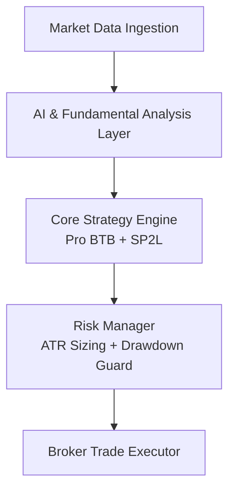

A production-grade, highly automated algorithmic trading framework built for institutional FX execution, specifically optimized for **XAUUSD (Gold)**. 

> **Note on Intellectual Property:** This repository serves as a public architectural showcase and technical portfolio landing page. The core execution engine, proprietary trading algorithms, and internal enterprise modules reside in a secured, private repository. 

---

## 🚀 Technical Core Pillars & Capabilities

This framework showcases my engineering expertise as a **Senior Python & AI Engineer**, specializing in clean architecture, high-throughput financial systems, and deterministic automation.

### 1. Advanced Architecture & Software Engineering
* **Service Layer Pattern:** Strict decoupling of business logic, risk calculation, and trade execution. No raw processing inside the integration layers.
* **Robust Type-Hinting & Strict OOP:** Built with maintainability and enterprise scale in mind, utilizing abstract base classes, protocol enforcement, and complete type safety.
* **Comprehensive Multi-Model Logging:** Async-ready, single/multi-model structured logging architecture that logs system states, broker signals, and API responses directly into a persistence layer for real-time compliance auditing.

### 2. Algorithmic Trading Mechanics (Domain Expertise)
* **Mechanical Price Action Engines:** Automated implementation of advanced structural setups including **Pro BTB** (Professional Back to Breakeven) and **SP2L** (Spike 2Leg).
* **Institutional Risk Guardrails:** The core engine features rigorous, non-negotiable defensive wrappers:
  * Dynamic position sizing based on real-time volatility ($ATR$).
  * Hardcoded daily maximum drawdown limits and max-loss-per-trade caps.
  * Adaptive leverage control and exposure mitigations during high-impact market regimes.

### 3. Artificial Intelligence & Cognitive Filtering
* **LLM Sentiment Fusion:** Integrates a multi-agent generative AI layer utilizing structured prompt streaming to evaluate live macroeconomic shifts and fundamental news.
* **Advanced Context Gathering:** Acts as a secondary confirmation filter. The system pipes current market structural states alongside real-time news to validate high-probability setups, drastically reducing false breakouts.

---

## 🛠️ Production Tech Stack

| Component | Technology | Rationale |
| :--- | :--- | :--- |
| **Language & Core** | Python 3.11+ / Asyncio | High-performance asynchronous execution for live market feeds. |
| **AI Integration** | OpenAI API / Custom LLM Wrappers | Structured JSON outputs for automated qualitative evaluation. |
| **Data & Ledger** | SQLite / PostgreSQL | Thread-safe transaction journaling and strict auditing. |
| **Configuration** | Python-Decouple / Environ | Zero hardcoded secrets; strict adherence to 12-Factor App methodology. |

---

## 📐 System Architecture Blueprint

---

## 🧑‍💻 About the Engineer

I am a **Senior Python / AI Engineer** who thrives on efficiency, clean architecture, and bulletproof automation. My default development state is **Production-Ready**, ensuring that every pipeline I deploy contains optimized code, clear separation of concerns, enterprise DevOps readiness, and absolute stability under heavy operational loads.

* **Specialties:** Enterprise Algorithmic Trading Systems, Scalable Machine Learning Pipelines, Backend Architecture Design, and High-Throughput Async Systems.
* **GitHub Profile:** [@saeidsaadatigero](https://github.com/saeidsaadatigero)
