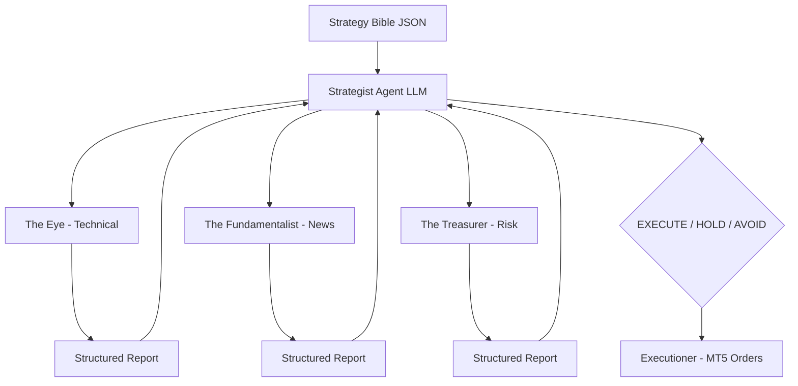

# 🦁 Persian Lion AI Trader — Agentic Trading System

A production-grade, **Hierarchical Multi-Agent Algorithmic Trading System** featuring a custom lightweight agent architecture with LLM-powered orchestration. Built for institutional-grade FX & Index execution, optimized for **XAUUSD (Gold)** and **DowJones30 (US30)**.

> **Note on Intellectual Property:** This repository serves as a public architectural portfolio. The core execution engine resides in a secured, private repository.

---

## 🚀 Key Technical Capabilities

### 1. Custom Multi-Agent Architecture (No Heavy Frameworks)
Designed and implemented a **Hierarchical Agent System** from scratch — no LangGraph, no CrewAI, no AutoGen. Four specialist agents report to a central LLM-powered Orchestrator with structured JSON decision-making.

```
STRATEGIST (LLM) ←→ [THE EYE] [FUNDAMENTALIST] [TREASURER] → EXECUTIONER
```

- **Agent Communication**: Structured report passing (not chat-based)
- **Latency**: Sub-millisecond agent coordination (pure Python, no RPC overhead)
- **Fallback**: Automatic rule-based decision engine when LLM is unavailable

### 2. LLM Integration (DeepSeek)
- Custom **Structured Prompt Engineering** with JSON output enforcement
- System prompt derived from a 50+ hour trading mentorship **Strategy Bible (JSON)**
- Context Analysis every 30 minutes + Daily Performance Report
- **Cost**: ~$0.20/month for continuous operation

### 3. Institutional Risk Management
- Dynamic lot sizing: `Balance × Risk% / (StopLoss × TickValue)`
- Hard daily drawdown limits with mandatory cooldown
- **Anti-Correlation Rule**: Automatic duplicate direction blocking
- **Kill Zone Override**: Volatility-adjusted risk during market opens

### 4. Pure Price Action Engine (6 Sub-Strategies)
- MTR (Major Trend Reversal) | BLSH Range | Flag Breakout | Spike Momentum | SP2L | Pro BTB
- Market Cycle Detection: SPIKE → CHANNEL → TRADING RANGE
- Signal Bar + Key Bar confirmation system

---

## 🛠️ Tech Stack

| Component | Technology |
|---|---|
| **Language** | Python 3.11+ |
| **AI/LLM** | DeepSeek API, OpenAI API |
| **Trading Platform** | MetaTrader 5 (Python bindings) |
| **Data** | SQLite, Pandas, TA-Lib |
| **Deployment** | Windows VPS, Git, CI/CD |
| **Architecture** | Custom Lightweight Multi-Agent System |

---

## 📊 System Architecture



---

## 🧑‍💻 About the Engineer

I am a **Senior Python & AI Engineer** with deep expertise in building **Agentic AI Systems** for financial markets. I design and implement custom multi-agent architectures, LLM orchestration layers, and production-grade trading infrastructure. My core strengths:

- **AI Engineering**: Custom agent architectures, structured prompt engineering, LLM integration into real-time systems
- **Financial Domain**: Price Action trading, risk management, MetaTrader 5 automation
- **Software Engineering**: Clean architecture, strict OOP, type-safe Python, production DevOps

**GitHub:** [@saeidsaadatigero](https://github.com/saeidsaadatigero)
